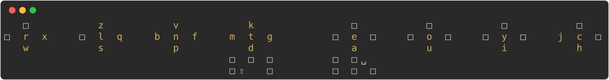

# Svalboard Layout Design Philosophy

A keyboard layout for the [Svalboard](https://svalboard.com/), built on
[Hands Down Neu](https://sites.google.com/alanreiser.com/handsdown/home/hands-down-neu).

> **Note:** This is my personal take on Svalboard layout design. I've grounded
> these ideas in biomechanics research, but the specific choices are hypotheses,
> not proven facts. The optimizer is fully configurable — tweak the metrics and
> constraints to test your own hypotheses.

## Layout Metrics

| Metric             | Value                                                |
| ------------------ | ---------------------------------------------------- |
| **Hand Balance**   | 51.3% / 48.7%                                        |
| **Finger Balance** | 8.3 / 11.0 / 13.9 / 18.1 — 20.6 / 11.0 / 9.2 / 7.9   |
| **SFB**            | 0.24%                                                |
| **Scissors**       | Vertical 0.02%, Squeeze 0%, Splay 0%                 |
| **Rolls**          | 45.9% total (29.1% in, 12.5% out, 4.3% Center→South) |
| **Alternation**    | 40.8%                                                |
| **Redirect**       | 3.2% (weak: 0.5%)                                    |
| **SFS**            | 5.3%                                                 |

## Design Goals

This layout adapts Hands Down Neu to the Svalboard's geometry:

1. **Comfort over speed** — Minimize strain and misfires
2. **Simplicity** — No repeat keys, thumb alphas, adaptive keys, lingering keys,
   or homerow mods
3. **Hands Down Neu DNA** — High in:out roll ratio, high hand alternation,
   low same-finger bigrams

## Why Adapt for Svalboard?

The Svalboard's key clusters pose biomechanical challenges flat keyboards lack:

- **Sympathetic coupling** triggers misfires when adjacent fingers move opposite ways
- **North keys** demand uncomfortable extension, especially for repeats

## Biomechanical Research

Peer-reviewed finger-interdependence research grounds these metrics.

### Finger Enslaving

When one finger exerts force, adjacent fingers fire involuntarily. This
"enslaving effect" follows a hierarchy:

| Finger Pair  | Coupling Strength |
| ------------ | ----------------- |
| Ring-Pinky   | Highest (19–57%)  |
| Middle-Ring  | Moderate (25–41%) |
| Index-Middle | Lowest (13–32%)   |

Key findings from Zatsiorsky et al. [1]:

- Slave fingers produce up to 67.5% of their max force involuntarily
- Enslaving persists with intrinsic muscles alone — evidence of neural, not just
  mechanical, coupling
- Multi-finger enslaving is often weaker than single-finger (non-additive)

### Sympathetic Movement

Adjacent fingers moving the same direction benefit from enslaving: the first
finger primes the second. Opposite directions create conflict: the second finger
fights residual force from the first.

The optimizer ignores center (rest position) — no movement occurs there.

### Finger Order Matters

Enslaving is asymmetric: the second finger in a sequence suffers more enslaving
than the first. Middle→Ring is harder than Ring→Middle because the ring finger
fights the middle's residual force. The optimizer encodes this asymmetry with
ordered finger-pair factors.

## Metric Implementation

The configuration in `config/evaluation/sval.yml` encodes these principles.

### Sympathetic Metric

Penalizes bigrams where adjacent fingers move opposite directions. Finger-pair
coupling factors scale the penalty — Ring-Pinky highest.

### SFB (Same Finger Bigram) Metric

- **Center→South counts as a roll**, not an SFB — natural curling motion.
  Examples: `ea`, `ch`, `ls`
- Other directions incur penalties based on discomfort
- Weaker fingers carry higher multipliers

### FSB (Full Scissor Bigram) Metric

Penalizes uncomfortable opposing movements between adjacent fingers:

- **Vertical** — North ↔ South
- **Squeeze** — Fingers move toward each other
- **Splay** — Fingers move apart

### Character Constraints

- **High-frequency double consonants**: Center/South for all fingers; pinky restricted to Center only
- **Mid-frequency double consonants**: Index/Middle allow all except North; Ring allows Center/South; Pinky allows Center only
- Punctuation stays off Center and South to preserve homerow flow

## References

1. Zatsiorsky VM, Li ZM, Latash ML. **Enslaving effects in multi-finger force
   production.** Exp Brain Res. 2000;131:187–195.
   [DOI: 10.1007/s002219900261](https://doi.org/10.1007/s002219900261)

2. Häger-Ross C, Schieber MH. **Quantifying the independence of human finger
   movements: comparisons of digits, hands, and movement frequencies.**
   J Neurosci. 2000;20(22):8542–8550.
   [DOI: 10.1523/JNEUROSCI.20-22-08542.2000](https://doi.org/10.1523/JNEUROSCI.20-22-08542.2000)

3. Martin JR, Latash ML, Zatsiorsky VM. **Interaction of finger enslaving and
   error compensation in multiple finger force production.**
   Exp Brain Res. 2009;192(2):293–298.
   [DOI: 10.1007/s00221-008-1615-2](https://doi.org/10.1007/s00221-008-1615-2)
